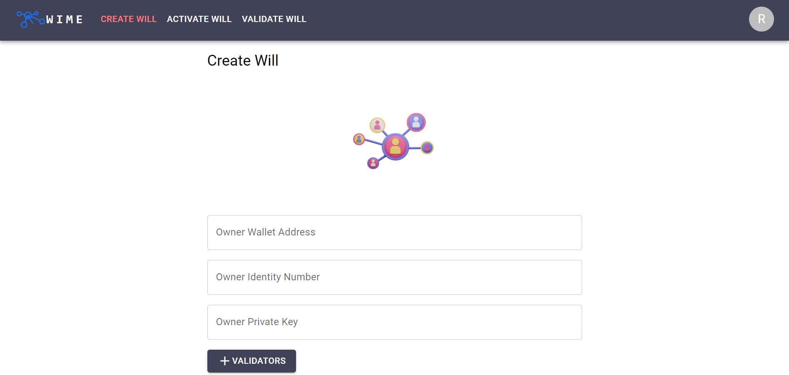

# WIME - Wealth Inheritance Made Easy
A solution aims to address the growing need for secure and efficient inheritance management in the digital age.

Link to prototype: https://wime-gilt.vercel.app

## Inspiration
We were inspired to create WIME to address the growing need for secure and efficient inheritance management in the digital age. With the increasing amount of digital assets, such as cryptocurrency and online accounts, traditional inheritance methods are becoming outdated and vulnerable to fraud or hacking. We wanted to create a solution that would provide peace of mind for individuals, while also reducing the need for intermediaries and lowering costs.

## What it does
WIME is a smart contract-powered wealth inheritance and protection service that automates the inheritance process, reduces the need for intermediaries, and lowers costs. WIME aims to offer a secure and transparent means of transferring digital assets upon inheritance, including cryptocurrency, online accounts and other digital assets.

## How we built it
We built WIME using Solidity and the Ethereum blockchain, which allows for the creation of smart contracts that can handle the inheritance process in a secure and transparent manner. We also utilized ethers.js to interact with the smart contract from our front-end, and React for the user interface.

## Challenges we ran into
One of the main challenges we encountered was ensuring the security of the smart contract, as any vulnerabilities could potentially lead to the loss of digital assets. We also had to navigate the complexities of blockchain technology and smart contract development, which required a lot of research and testing.

## Accomplishments that we're proud of
We are proud of creating a functional and secure smart contract-based solution for inheritance management, as well as designing a user-friendly interface that makes the inheritance process easy and straightforward. We believe WIME can make a positive impact on the way people manage their digital assets and plan for inheritance.

## What we learned
Through this project, we gained a deeper understanding of blockchain technology and smart contract development, as well as the importance of security in these types of projects. We also learned the importance of user experience in creating a successful and widely adopted solution.

## What's next for WIME
We plan to continue developing and improving WIME, with a focus on adding more digital assets and supporting more blockchain platforms. We also plan to conduct more user testing and gather feedback to ensure that we are meeting the needs of our users. Additionally, we are exploring partnerships and collaborations with other companies and organizations in the field of inheritance management and blockchain technology.
